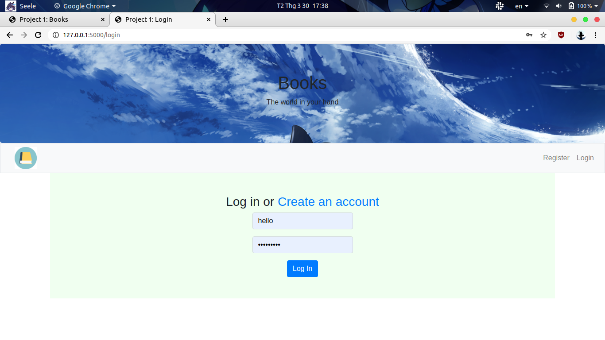
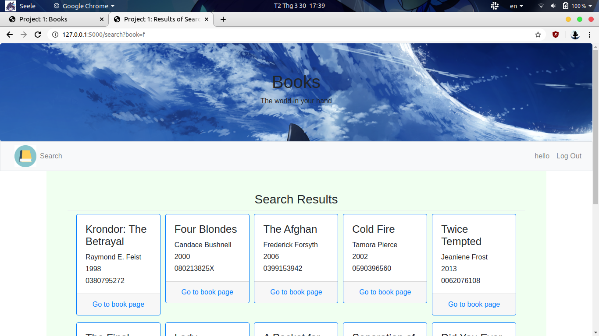
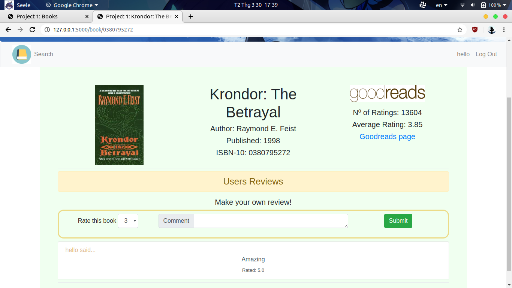

# Project 1 : Books

CS50 Web Programming with Python and JavaScript Edx

## :gear: Note before run the code (I use Ubuntu Os with Window use "set" instead)
```bash
$ python3 -m venv myvirtualenv

# Activate the virtualenv
$ source myvirtualenv/bin/activate (Linux)

# Install all dependencies
$ pip install -r requirements.txt

$ export FLASK_APP=application.py
$ export FLASK_DEBUG=1
$ export DATABASE_URL=#Heroku Postgres DBURI
$ export GOODREADS_KEY=GoodReadAPIKey.
```
# Some img about app




*** Database on Heroku (Adminer base on CS50 of HarvardX on EDX, If you like, Please Register and learn on EDX)***
1. Navigate to https://www.heroku.com/, and create an account if you don’t already have one.
2. On Heroku’s Dashboard, click “New” and choose “Create new app.”
3. Give your app a name, and click “Create app.” 
4. On your app’s “Overview” page, click the “Configure Add-ons” button.
5. In the “Add-ons” section of the page, type in and select “Heroku Postgres.”
6. Choose the “Hobby Dev - Free” plan, which will give you access to a free PostgreSQL database that will support up to 10,000 rows of data. Click “Provision.”
7. Now, click the “Heroku Postgres :: Database” link.
8. You should now be on your database’s overview page. Click on “Settings”, and then “View Credentials.” This is the information you’ll need to log into your database.
9. ou can access the database via [Adminer](https://adminer.cs50.net/), filling in the server (the “Host” in the credentials list), your username (the “User”), your password, and the name of the database, all of which you can find on the Heroku credentials page.

# Database Structure
```bash
CREATE TABLE users (
    user_id SERIAL PRIMARY KEY,
    username TEXT NOT NULL,
    password TEXT NOT NULL
);
CREATE TABLE books(
    book_id SERIAL PRIMARY KEY,
    isbn TEXT NOT NULL,
    title TEXT NOT NULL,
    author TEXT NOT NULL,
    year NUMERIC
);
CREATE TABLE reviews (
    user_id INTEGER NOT NULL,
    book_id INTEGER NOT NULL,
    comment TEXT NOT NULL,
    rating REAL NOT NULL,
    FOREIGN KEY(user_id) REFERENCES users(user_id),
    FOREIGN KEY(book_id) REFERENCES books(book_id)
);
```

# File
**application.py**
1. Login, Logout
2. Register
3. Searching
4. return Json when use /api/<isbn>

**import.py**
1. import csv, sqlalchemy
2. add book into database from books.csv file
3. Just run when y run direct import.py

**helper.py**
1. build login_require method for login status

**static**
1. `style.css` style for `layout.html`and other file `html`
2. img goodread logo

**templates**
1. `layout.html` this is main templates for all page
2. `login.html`, `register.html` for login,register UI
3. `error.html` for error message show
4. `book.html` for book detail page
5. `result_search` show all book that user want to find
